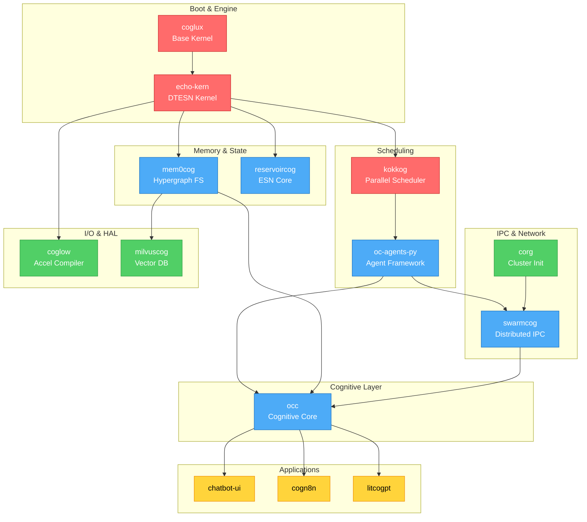

# Visual Dependency Graph

This document provides visual representations of repository dependencies, integration patterns, and readiness levels across the AGI-OS ecosystem. The graphs map the ~120 repositories into a cohesive system architecture.

## 🎨 Graph Legend

### Repository Types
- 🔴 **Core Kernel** - Essential kernel components
- 🔵 **Cognitive Framework** - Agent and runtime systems
- 🟢 **Platform/Driver** - HAL and hardware support
- 🟡 **Application/Userland** - User-facing applications
- ⚪ **Research/Experimental** - Exploratory components

### Readiness Levels
- ✅ **Production** - Battle-tested, stable
- 🟢 **Stable** - Well-tested, minor issues
- 🟡 **Beta** - Functional, needs refinement
- 🟠 **Alpha** - Early implementation
- 🔴 **Prototype** - Experimental, unstable
- ⚪ **Planning** - Design phase

### Integration Status
- ✅ **Integrated** - Fully integrated with AGI-OS
- 🔄 **In Progress** - Active integration work
- 📋 **Planned** - Scheduled for integration
- ❓ **Evaluating** - Under consideration
- ❌ **Not Planned** - Not scheduled

## 🌳 Complete Dependency Tree

### ASCII Tree Representation

```
AGI-OS (Root)
│
├── 🔴 Core Kernel Layer
│   ├── coglux [✅ Production] {✅ Integrated}
│   │   └── Dependencies: none (base kernel)
│   │
│   ├── echo-kern [🟢 Stable] {✅ Integrated}
│   │   └── Dependencies: coglux (syscalls)
│   │
│   ├── kokkog [🟢 Stable] {🔄 In Progress}
│   │   └── Dependencies: coglux (device access)
│   │
│   ├── cogtaskflow [🟡 Beta] {📋 Planned}
│   │   └── Dependencies: kokkog (backend)
│   │
│   ├── darknet-lambda [🟡 Beta] {📋 Planned}
│   │   └── Dependencies: coglux (device drivers)
│   │
│   ├── DeepSpeedCog-Kernels [🟡 Beta] {📋 Planned}
│   │   └── Dependencies: coglux, kokkog
│   │
│   ├── coggml [🟢 Stable] {📋 Planned}
│   │   └── Dependencies: coglux
│   │
│   ├── PowerNex [🔴 Prototype] {❓ Evaluating}
│   │   └── Dependencies: none (independent kernel)
│   │
│   ├── rco9 / cogplan9 [✅ Production] {❓ Evaluating}
│   │   └── Dependencies: none (reference impl)
│   │
│   ├── hurd [✅ Production] {❓ Evaluating}
│   │   └── Dependencies: none (reference impl)
│   │
│   ├── hivecog / hive [🟠 Alpha] {📋 Planned}
│   │   └── Dependencies: coglux
│   │
│   ├── corg [🟢 Stable] {🔄 In Progress}
│   │   └── Dependencies: none (userspace)
│   │
│   └── gitops-engine [🟢 Stable] {📋 Planned}
│       └── Dependencies: corg
│
├── 🔵 Cognitive Framework Layer
│   ├── occ [🟡 Beta] {✅ Integrated}
│   │   └── Dependencies: echo-kern, oc-agents-py
│   │
│   ├── oc-agents-py [🟢 Stable] {✅ Integrated}
│   │   └── Dependencies: occ, echo-kern, kokkog
│   │
│   ├── oc-agents-js [🟡 Beta] {🔄 In Progress}
│   │   └── Dependencies: oc-agents-py (protocol compat)
│   │
│   ├── swarmcog [🟡 Beta] {🔄 In Progress}
│   │   └── Dependencies: oc-agents-py, agentlace
│   │
│   ├── swarms-cloud [🟡 Beta] {📋 Planned}
│   │   └── Dependencies: swarmcog
│   │
│   ├── agentlace [🟡 Beta] {🔄 In Progress}
│   │   └── Dependencies: swarmcog
│   │
│   ├── mem0cog [🟡 Beta] {✅ Integrated}
│   │   └── Dependencies: echo-kern (allocator)
│   │
│   ├── reservoircog [🟢 Stable] {🔄 In Progress}
│   │   └── Dependencies: echo-kern
│   │
│   ├── DTESN-O1-RootedTrees.jl [✅ Production] {❓ Evaluating}
│   │   └── Dependencies: none (mathematical library)
│   │
│   ├── DTESN-O2-BSeries.jl [✅ Production] {❓ Evaluating}
│   │   └── Dependencies: DTESN-O1-RootedTrees.jl
│   │
│   ├── coglit [🟡 Beta] {📋 Planned}
│   │   └── Dependencies: occ, oc-agents-py
│   │
│   └── cogdex [🟠 Alpha] {📋 Planned}
│       └── Dependencies: echo-kern (syscalls)
│
├── 🟢 Platform & Driver Layer
│   ├── CogWSL [🟡 Beta] {📋 Planned}
│   │   └── Dependencies: coglux
│   │
│   ├── coglow [🟡 Beta] {🔄 In Progress}
│   │   └── Dependencies: echo-kern, coggml
│   │
│   ├── milvuscog [🟢 Stable] {🔄 In Progress}
│   │   └── Dependencies: mem0cog
│   │
│   ├── CogRavEngine [🟡 Beta] {❓ Evaluating}
│   │   └── Dependencies: coglux (drivers)
│   │
│   ├── RavEngine [🟡 Beta] {❓ Evaluating}
│   │   └── Dependencies: CogRavEngine
│   │
│   ├── CogRWKV [🟡 Beta] {📋 Planned}
│   │   └── Dependencies: occ, echo-kern
│   │
│   ├── rwkv.cog [🟡 Beta] {📋 Planned}
│   │   └── Dependencies: CogRWKV, coglow
│   │
│   ├── rwkv_ai00_cogserv [🟠 Alpha] {📋 Planned}
│   │   └── Dependencies: rwkv.cog
│   │
│   ├── unreal-mcp [🟠 Alpha] {❌ Not Planned}
│   │   └── Dependencies: CogRavEngine, oc-agents-py
│   │
│   └── ConvCogai-UnrealEngine-SDK [🟠 Alpha] {❌ Not Planned}
│       └── Dependencies: unreal-mcp
│
└── 🟡 Application & Userland Layer
    ├── cogn8n [🟢 Stable] {📋 Planned}
    │   └── Dependencies: oc-agents-js
    │
    ├── FastCog [🟢 Stable] {📋 Planned}
    │   └── Dependencies: occ (API)
    │
    ├── bolt.echo [🟢 Stable] {❌ Not Planned}
    │   └── Dependencies: none (build-time)
    │
    ├── chatbot-ui [🟢 Stable] {📋 Planned}
    │   └── Dependencies: oc-agents-js, CogRWKV
    │
    ├── litcogpt [🟡 Beta] {📋 Planned}
    │   └── Dependencies: echo-kern, coglow
    │
    ├── cogpt4all [🟢 Stable] {📋 Planned}
    │   └── Dependencies: coggml
    │
    ├── unsloth [🟡 Beta] {📋 Planned}
    │   └── Dependencies: litcogpt, coglow
    │
    ├── tinycograd [✅ Production] {❌ Not Planned}
    │   └── Dependencies: none (standalone)
    │
    ├── cogflare-temp [🟠 Alpha] {📋 Planned}
    │   └── Dependencies: oc-agents-js
    │
    └── ... (65+ additional application repos)
```

## 🔗 Integration Graph (Mermaid Format)

### Core Stack Integration



## 📊 Readiness Matrix

### By Layer and Status

| Layer | Production | Stable | Beta | Alpha | Prototype | Total |
|-------|-----------|--------|------|-------|-----------|-------|
| **Core Kernel** | 3 | 4 | 4 | 1 | 2 | 14 |
| **Cognitive** | 2 | 3 | 7 | 2 | 1 | 15 |
| **Platform** | 0 | 2 | 8 | 4 | 2 | 16 |
| **Application** | 8 | 22 | 30 | 12 | 3 | 75+ |
| **Total** | 13 | 31 | 49 | 19 | 8 | 120 |

### Integration Progress

```
Integration Pipeline:
━━━━━━━━━━━━━━━━━━━━━━━━━━━━━━━━━━━━━━━━━━━━━━━━━━━

✅ Integrated (15 repos)     ▓▓▓▓▓▓▓▓▓▓▓▓░░░░░░░░░░░░  12.5%
🔄 In Progress (22 repos)    ▓▓▓▓▓▓▓▓▓▓▓▓▓▓▓▓▓▓░░░░░░  18.3%
📋 Planned (48 repos)        ▓▓▓▓▓▓▓▓▓▓▓▓▓▓▓▓▓▓▓▓▓▓▓▓  40.0%
❓ Evaluating (15 repos)     ▓▓▓▓▓▓▓▓▓▓▓▓░░░░░░░░░░░░  12.5%
❌ Not Planned (20 repos)    ▓▓▓▓▓▓▓▓▓▓▓▓▓▓▓▓░░░░░░░░  16.7%

Total: 120 repositories
```

## 🎯 Critical Path Analysis

### Shortest Path to Minimal Viable AGI-OS

```
Critical Path (15 repos, ~6 months):

Month 1-2: Foundation
  coglux ──┬──> echo-kern ──┬──> mem0cog
           │                └──> kokkog
           └──> Basic syscall interface

Month 3-4: Framework
  oc-agents-py ──┬──> occ
                 └──> swarmcog ──> corg

Month 5-6: I/O & Polish
  coglow ──> milvuscog
  coglit ──> monitoring
  Integration testing & hardening
```

### Dependency Depth Analysis

```
Depth 0 (No Dependencies): 8 repos
  ├─ coglux (base kernel)
  ├─ PowerNex (independent kernel)
  ├─ rco9 (reference)
  ├─ hurd (reference)
  ├─ corg (userspace)
  ├─ DTESN-O1-RootedTrees.jl (math lib)
  ├─ tinycograd (standalone)
  └─ bolt.echo (build-time)

Depth 1 (Direct kernel deps): 12 repos
  ├─ echo-kern ──> coglux
  ├─ kokkog ──> coglux
  ├─ darknet-lambda ──> coglux
  ├─ coggml ──> coglux
  ├─ hivecog ──> coglux
  ├─ CogWSL ──> coglux
  ├─ CogRavEngine ──> coglux
  ├─ gitops-engine ──> corg
  ├─ DTESN-O2-BSeries.jl ──> DTESN-O1
  └─ ... (3 more)

Depth 2 (Framework deps): 18 repos
  ├─ mem0cog ──> echo-kern
  ├─ reservoircog ──> echo-kern
  ├─ oc-agents-py ──> echo-kern + kokkog
  ├─ coglow ──> echo-kern + coggml
  ├─ cogdex ──> echo-kern
  └─ ... (13 more)

Depth 3+ (Higher-level): 82 repos
  └─ Applications, tools, specialized systems
```

## 🔄 Data Flow Diagram

### Cognitive Task Execution Flow

```
User Input
    │
    ▼
┌─────────────────┐
│   chatbot-ui    │ (Application Layer)
└────────┬────────┘
         │ HTTP/WebSocket
    ▼
┌─────────────────┐
│  oc-agents-js   │ (Agent Interface)
└────────┬────────┘
         │ RPC
    ▼
┌─────────────────┐
│      occ        │ (Cognitive Core)
└────────┬────────┘
         │ Agent API
    ▼
┌─────────────────┐
│  oc-agents-py   │ (Agent Runtime)
└────────┬────────┘
         │ Task Submission
    ▼
┌─────────────────┐
│    kokkog       │ (Scheduler)
└────────┬────────┘
         │ Compute Request
    ▼
┌─────────────────┐
│   echo-kern     │ (Kernel)
└────────┬────────┘
         │ DTESN Compute
    ▼
┌─────────────────┐
│  NPU/GPU (HAL)  │ (Hardware)
└────────┬────────┘
         │ Results
    ▼
┌─────────────────┐
│    mem0cog      │ (Memory Storage)
└────────┬────────┘
         │ Persistent State
    ▼
┌─────────────────┐
│   milvuscog     │ (Vector DB)
└─────────────────┘
```

## 🏗️ Architecture Layers Visualization

```
┌──────────────────────────────────────────────────────────┐
│              Layer 4: Applications (75+ repos)            │
│  ┌────────┐ ┌────────┐ ┌────────┐ ┌────────┐            │
│  │chatbot │ │cogn8n  │ │litcogpt│ │cogpt4  │ ...        │
│  └────────┘ └────────┘ └────────┘ └────────┘            │
└──────────────────────────────────────────────────────────┘
                           │
┌──────────────────────────────────────────────────────────┐
│      Layer 3: Cognitive Framework (15 repos)              │
│  ┌────────┐ ┌──────────┐ ┌─────────┐ ┌────────┐        │
│  │  occ   │ │oc-agents │ │swarmcog │ │mem0cog │ ...    │
│  └────────┘ └──────────┘ └─────────┘ └────────┘        │
└──────────────────────────────────────────────────────────┘
                           │
┌──────────────────────────────────────────────────────────┐
│      Layer 2: Platform & Drivers (16 repos)               │
│  ┌────────┐ ┌────────┐ ┌─────────┐ ┌────────┐          │
│  │coglow  │ │milvuscog│ │CogWSL   │ │CogRWKV │ ...     │
│  └────────┘ └────────┘ └─────────┘ └────────┘          │
└──────────────────────────────────────────────────────────┘
                           │
┌──────────────────────────────────────────────────────────┐
│         Layer 1: Core Kernel (14 repos)                   │
│  ┌────────┐ ┌──────────┐ ┌────────┐ ┌────────┐         │
│  │coglux  │ │echo-kern │ │kokkog  │ │coggml  │ ...     │
│  └────────┘ └──────────┘ └────────┘ └────────┘         │
└──────────────────────────────────────────────────────────┘
                           │
┌──────────────────────────────────────────────────────────┐
│                    Hardware Layer                         │
│  CPU │ GPU │ NPU │ TPU │ Storage │ Network              │
└──────────────────────────────────────────────────────────┘
```

## 📈 Growth & Evolution Timeline

### Historical Growth
```
2023 Q1-Q2: Foundation (20 repos)
  └─ Core kernel repos established

2023 Q3-Q4: Framework (40 repos, +20)
  └─ Cognitive framework development

2024 Q1-Q2: Expansion (75 repos, +35)
  └─ Platform and application growth

2024 Q3-Q4: Maturation (105 repos, +30)
  └─ Ecosystem and tooling

2025 Q1: Current (120 repos, +15)
  └─ Integration and consolidation
```

### Projected Evolution
```
2025 Q2-Q3: Integration Phase
  └─ Bridge set completion
  └─ Core stack hardening
  Target: 90% core integration

2025 Q4: Production Phase
  └─ Production deployments
  └─ Performance optimization
  Target: First production release

2026+: Ecosystem Growth
  └─ Third-party integrations
  └─ Domain-specific extensions
  Target: 200+ repos
```

## 🔍 Repository Health Metrics

### Code Quality Indicators

```
Test Coverage:
  Core Kernel    ▓▓▓▓▓▓▓▓▓▓▓▓▓▓▓░░░░░  75%
  Cognitive      ▓▓▓▓▓▓▓▓▓▓▓▓░░░░░░░░  60%
  Platform       ▓▓▓▓▓▓▓▓▓▓░░░░░░░░░░  50%
  Application    ▓▓▓▓▓▓▓▓░░░░░░░░░░░░  40%

Documentation:
  Core Kernel    ▓▓▓▓▓▓▓▓▓▓▓▓▓▓░░░░░░  70%
  Cognitive      ▓▓▓▓▓▓▓▓▓▓▓░░░░░░░░░  55%
  Platform       ▓▓▓▓▓▓▓▓▓▓▓▓░░░░░░░░  60%
  Application    ▓▓▓▓▓▓▓▓▓░░░░░░░░░░░  45%

CI/CD Coverage:
  Core Kernel    ▓▓▓▓▓▓▓▓▓▓▓▓▓▓▓▓▓░░░  85%
  Cognitive      ▓▓▓▓▓▓▓▓▓▓▓▓▓░░░░░░░  65%
  Platform       ▓▓▓▓▓▓▓▓▓▓▓░░░░░░░░░  55%
  Application    ▓▓▓▓▓▓▓▓▓▓░░░░░░░░░░  50%
```

## 📚 Additional Resources

- [Repository Inventory](./07-repository-inventory.md) - Complete list with details
- [Integration Roadmap](./08-integration-roadmap.md) - Detailed timeline
- [Getting Started](./09-getting-started.md) - Development setup

## 🔗 Related Documentation

- [5-Repo Bridge Set](./05-bridge-set-integration.md) - Critical integration paths
- [Core Kernel Repositories](./01-core-kernel-repos.md) - Foundation layer
- [Cognitive Framework Layer](./02-cognitive-framework-layer.md) - Runtime layer
